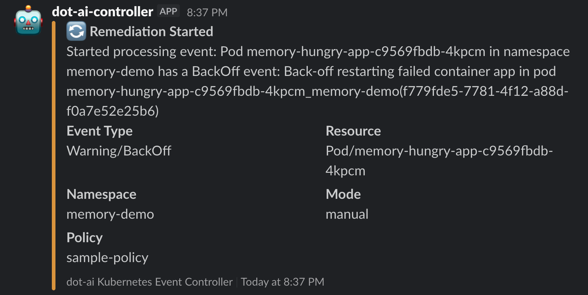
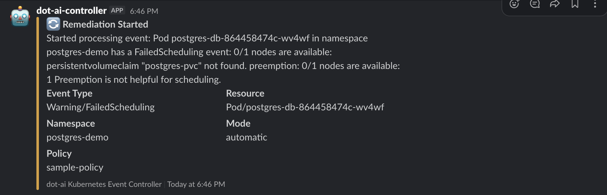

# DevOps AI Toolkit Controller

A Kubernetes controller that watches cluster events and forwards them to the [DevOps AI Toolkit](https://github.com/vfarcic/dot-ai) MCP remediate tool for AI-powered analysis and remediation. This controller acts as the bridge between Kubernetes cluster events and the DevOps AI Toolkit.

## Description

The DevOps AI Toolkit Controller monitors Kubernetes events (like pod failures, crashes, scheduling issues) and automatically sends them to the [DevOps AI Toolkit MCP remediate tool](https://github.com/vfarcic/dot-ai/blob/main/docs/mcp-remediate-guide.md) for analysis. It supports:

- **Event Watching**: Configurable filtering of Kubernetes events by type, reason, and involved objects
- **DevOps AI Toolkit Integration**: Sends events to the DevOps AI Toolkit MCP remediate tool for intelligent analysis and remediation suggestions  
- **Slack Notifications**: Rich notifications with remediation results and next steps
- **Rate Limiting**: Prevents event storms with configurable cooldowns
- **Status Reporting**: Comprehensive observability through status updates and Kubernetes events

## Prerequisites

- **kubectl** v1.11.3+ (tested with v1.33.3)
- **Helm** v3.0+ (tested with v3.18.4)
- **Access to a Kubernetes cluster** v1.11.3+ (tested with v1.33.1)
- **[DevOps AI Toolkit](https://github.com/vfarcic/dot-ai) MCP service** running and accessible from the cluster

### Setting up a Test Cluster (Optional)

If you don't have a Kubernetes cluster, you can create one locally using Kind:

```bash
# Use isolated kubeconfig to avoid affecting existing configuration
export KUBECONFIG=$PWD/kubeconfig.yaml

# Create test cluster
kind create cluster --name dot-ai-controller-test

# Verify cluster access
kubectl cluster-info
```

## Installing the DevOps AI Toolkit MCP

The controller requires the DevOps AI Toolkit MCP service to be running in your cluster. Install it before deploying the controller:

### Prerequisites for MCP
- **Anthropic API key** - Get one from [Anthropic Console](https://console.anthropic.com/)

> **Note**: Check for the latest MCP version at [DevOps AI Toolkit Releases](https://github.com/vfarcic/dot-ai/releases)

### Install MCP Service

```bash
# Set your Anthropic API key
export ANTHROPIC_API_KEY="sk-ant-api03-..."

# Install the DevOps AI Toolkit MCP (check for latest version at link below)
helm install dot-ai-mcp oci://ghcr.io/vfarcic/dot-ai/charts/dot-ai:0.97.0 \
  --set secrets.anthropic.apiKey="$ANTHROPIC_API_KEY" \
  --create-namespace \
  --namespace dot-ai \
  --wait
```

### Verify MCP Installation

```bash
# Check that MCP pods are running
kubectl get pods --namespace dot-ai

# Verify MCP service is accessible
kubectl get svc --namespace dot-ai
```

You should see the `dot-ai-mcp` service running on port 3456. The controller will use the internal service URL: `http://dot-ai-mcp.dot-ai.svc.cluster.local:3456/api/v1/tools/remediate`

## Install DevOps AI Toolkit Controller

### Install via Helm (Recommended)

```bash
# Install the controller from OCI registry (check for latest version at link below)
helm install dot-ai-controller oci://ghcr.io/vfarcic/dot-ai-controller/charts/dot-ai-controller \
  --version 0.9.0 \
  --namespace dot-ai \
  --wait
```

**Note**: Check for the latest controller version at [releases](https://github.com/vfarcic/dot-ai-controller/releases) and update the `--version` parameter accordingly.

### Verify Controller Installation

```bash
# Check that the controller pod is running
kubectl get pods --selector app.kubernetes.io/name=dot-ai-controller --namespace dot-ai

# Check controller logs
kubectl logs --selector app.kubernetes.io/name=dot-ai-controller --namespace dot-ai --tail 10
```

The controller should be running and processing Kubernetes events. You'll see logs indicating "No RemediationPolicies found" until you create your first policy.

## Create a Sample RemediationPolicy

Create a RemediationPolicy to start processing events:

```bash
# Set your Slack webhook URL (optional)
export SLACK_WEBHOOK_URL="https://hooks.slack.com/services/YOUR/WEBHOOK/URL"

# Apply the policy directly
kubectl apply --filename - <<EOF
apiVersion: dot-ai.devopstoolkit.live/v1alpha1
kind: RemediationPolicy
metadata:
  name: sample-policy
  namespace: dot-ai
spec:
  # Multiple event selectors with different configurations
  # NOTE: Controller checks selectors in order and processes event on FIRST match
  eventSelectors:
    # Monitor pod scheduling failures - AUTOMATIC remediation
    - type: Warning
      reason: FailedScheduling
      involvedObjectKind: Pod
      mode: automatic                 # Safe to automatically fix scheduling issues
      confidenceThreshold: 0.85       # High confidence required for infrastructure changes
      maxRiskLevel: medium            # Allow medium-risk actions for infrastructure fixes
    
    # Monitor ALL remaining Warning events for ANY resource - MANUAL mode
    - type: Warning
      reason: ""                      # Empty = wildcard, matches ANY event reason
      involvedObjectKind: ""          # Empty = wildcard, matches ANY resource type
  
  # MCP endpoint using internal service URL
  mcpEndpoint: http://dot-ai-mcp.dot-ai.svc.cluster.local:3456/api/v1/tools/remediate
  mcpTool: remediate
  
  # Manual mode as global default (conservative approach)
  mode: manual
  
  # Global automatic mode configuration (used when mode=automatic)
  confidenceThreshold: 0.8            # Require 80% confidence for automatic actions
  maxRiskLevel: low                   # Only allow low-risk automatic actions by default
  
  # Conservative rate limiting for production
  rateLimiting:
    eventsPerMinute: 5                # Lower rate for production safety
    cooldownMinutes: 15               # Longer cooldown to prevent spam
  
  # Slack notifications configuration (DISABLED by default for safety)
  notifications:
    slack:
      enabled: false                   # Enable Slack notifications
      webhookUrl: "$SLACK_WEBHOOK_URL" # Replace with your actual webhook URL
      channel: "#tests"                # Channel where notifications will be sent
      notifyOnStart: true              # Notify when remediation starts
      notifyOnComplete: true           # Notify when remediation completes
EOF

# Verify the policy was created
kubectl get remediationpolicies --namespace dot-ai
```

## Test the RemediationPolicy

The DevOps AI Toolkit Controller supports both **automatic** and **manual** remediation modes:

- **Automatic Mode**: The system detects, analyzes, and fixes issues without human intervention
- **Manual Mode**: The system detects and analyzes issues, then provides remediation recommendations via Slack for humans to execute

### Example 1: Manual Remediation

Let's first test manual remediation by creating a memory-constrained application that will trigger OOMKilled warnings:

```bash
# Create a test namespace for manual remediation
kubectl create namespace memory-demo

# Create a memory-hungry application with insufficient memory limits
kubectl apply --filename - <<'EOF'
apiVersion: apps/v1
kind: Deployment
metadata:
  name: memory-hungry-app
  namespace: memory-demo
spec:
  replicas: 1
  selector:
    matchLabels:
      app: memory-hungry
  template:
    metadata:
      labels:
        app: memory-hungry
    spec:
      containers:
      - name: app
        image: nginx:alpine
        command: ["/bin/sh"]
        args: ["-c", "dd if=/dev/zero of=/tmp/memory.tmp bs=1M count=200; sleep 3600"]
        resources:
          limits:
            memory: "64Mi"
          requests:
            memory: "32Mi"
EOF

# Check the pod status (should show OOMKilled restarts)
kubectl get pods --selector app=memory-hungry --namespace memory-demo

# View the Warning events for OOMKilled in the memory-demo namespace
kubectl get events --namespace memory-demo --field-selector type=Warning,reason=BackOff

# Check controller logs to see event processing
kubectl logs --selector app.kubernetes.io/name=dot-ai-controller --namespace dot-ai --tail 20
```

### What Happens in Manual Mode

1. **Event Detection**: The controller detects Warning events for container restarts due to OOMKilled
2. **Policy Matching**: Matches the second event selector (wildcard Warning + manual mode from global policy)
3. **MCP Analysis**: The AI analyzes the issue and generates specific remediation commands
4. **Slack Notification**: Sends detailed notification with:
   - Problem analysis and root cause
   - **Recommended commands** to fix the issue (e.g., `kubectl patch deployment...` to increase memory limits)
   - Step-by-step remediation instructions
5. **Human Decision**: Users can:
   - Execute the recommended kubectl commands directly from their terminal
   - Apply changes to YAML files in Git (GitOps workflow)
   - Modify Helm values and redeploy
   - Use any other approach they prefer

**Key Difference**: In manual mode, the controller gets remediation recommendations from MCP and forwards them to Slack, but **never executes** the commands. Humans review the recommendations and decide how/when to implement them.

**Slack Notification - Manual Remediation Started:**


### Manual Remediation Analysis Results

The AI analysis completed successfully, providing detailed recommendations without executing them:

**Slack Notification - Manual Analysis Completed:**


**Manual Mode Results:**
- **Analysis Confidence**: 95%
- **Execution Time**: 79.78 seconds
- **Root Cause**: Container attempts to allocate 200MB but has 64Mi limit, causing OOMKilled failures
- **Recommended Action**: Specific `kubectl patch` command to increase memory limits to 256Mi with requests of 128Mi
- **Human Decision Required**: The system provides the exact command but waits for human execution

Users can now execute the recommended command:
```bash
kubectl patch deployment/memory-hungry-app -n memory-demo -p '{"spec":{"template":{"spec":{"containers":[{"name":"app","resources":{"limits":{"memory":"256Mi"},"requests":{"memory":"128Mi"}}}]}}}}'
```

### Example 2: Automatic Remediation

Now let's test automatic remediation with a real scenario - a PostgreSQL deployment that fails due to a missing PersistentVolumeClaim:

```bash
# Create a test namespace
kubectl create namespace postgres-demo

# Deploy PostgreSQL without creating the required PVC (this will cause FailedScheduling)
kubectl apply --namespace postgres-demo --filename - <<'EOF'
apiVersion: apps/v1
kind: Deployment
metadata:
  name: postgres-db
spec:
  replicas: 1
  selector:
    matchLabels:
      app: postgres
  template:
    metadata:
      labels:
        app: postgres
    spec:
      containers:
      - name: postgres
        image: postgres:13
        env:
        - name: POSTGRES_PASSWORD
          value: testpass
        - name: POSTGRES_DB
          value: testdb
        volumeMounts:
        - name: postgres-storage
          mountPath: /var/lib/postgresql/data
      volumes:
      - name: postgres-storage
        persistentVolumeClaim:
          claimName: postgres-pvc
EOF

# Check the pod status (should be Pending)
kubectl get pods --namespace postgres-demo

# View the Warning events that will trigger remediation
kubectl get events --namespace postgres-demo --field-selector type=Warning

# Check controller logs to see event processing
kubectl logs --selector app.kubernetes.io/name=dot-ai-controller --namespace dot-ai --tail 20
```

### What Happens in Automatic Mode

1. **Event Detection**: The controller detects the `FailedScheduling` Warning event
2. **Policy Matching**: Matches the first event selector (FailedScheduling + Pod + automatic mode)
3. **Slack Notification**: Sends "Remediation Started" notification to #tests channel with:
   - Event details (Warning/FailedScheduling)
   - Resource info (Pod/postgres-db-...)
   - Namespace (postgres-demo)
   - Mode (automatic)
   - Policy (sample-policy)
4. **MCP Request**: Sends automatic remediation request to DevOps AI Toolkit with:
   - High confidence threshold (0.85)
   - Medium risk level allowed
   - Detailed event description

**Slack Notification - Remediation Started:**


### Automatic Remediation Success

The DevOps AI Toolkit automatically resolved the issue! Here's what happened:

```bash
# The missing PVC was automatically created
kubectl get pvc --namespace postgres-demo

# The pod is now running successfully  
kubectl get pods --namespace postgres-demo

# Check the remediation success event
kubectl get events --namespace dot-ai --field-selector reason=McpRequestSucceeded
```

**Remediation Results:**
- **Execution Time**: 138.89 seconds  
- **Analysis Confidence**: 95%
- **Actions Taken**: 1 remediation action
- **Validation**: ✅ Passed - Pod transitioned from Pending to Running
- **Root Cause**: The postgres-pvc PersistentVolumeClaim was missing from the postgres-demo namespace
- **Solution**: Automatically created the missing PVC with appropriate storage configuration

**What the AI Did:**
1. **Analyzed** the FailedScheduling event and identified the missing PersistentVolumeClaim
2. **Created** the postgres-pvc PersistentVolumeClaim in the postgres-demo namespace with:
   - 1Gi capacity
   - ReadWriteOnce access mode  
   - Standard storage class
3. **Validated** the fix by confirming the pod moved from Pending to Running status

This demonstrates the power of **automatic remediation** - the system detected, analyzed, fixed, and validated the issue without human intervention, all while maintaining safety through confidence thresholds and risk levels.

**Slack Notification - Remediation Completed:**


## Cleanup

### Remove the Demo Cluster

If you used Kind for testing, simply remove the entire cluster:

```bash
# Delete the Kind cluster (removes everything)
kind delete cluster --name dot-ai-controller-test

# Remove the kubeconfig file
rm kubeconfig.yaml
```

This removes all resources, namespaces, and applications at once.

## Troubleshooting

For common issues and solutions, see the [Troubleshooting Guide](docs/troubleshooting.md).
