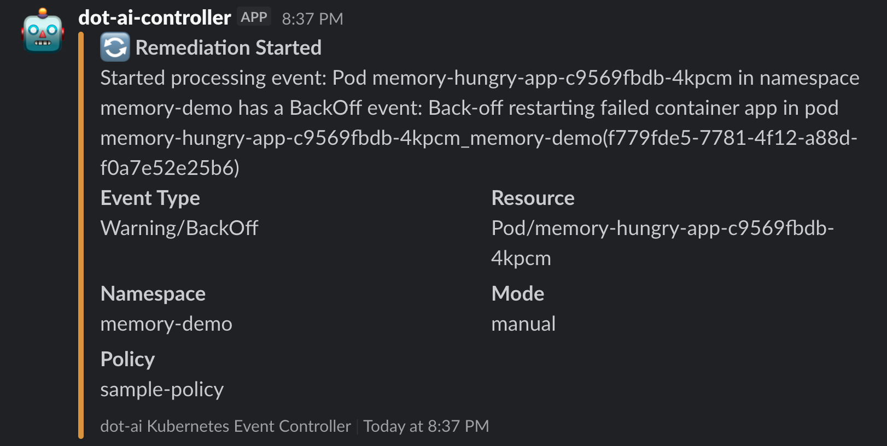
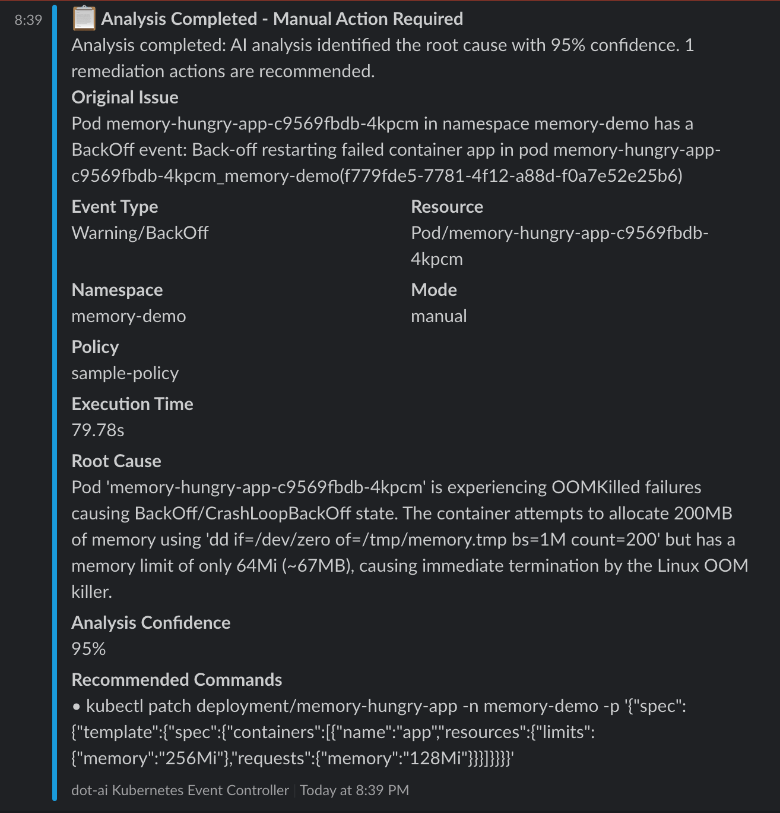
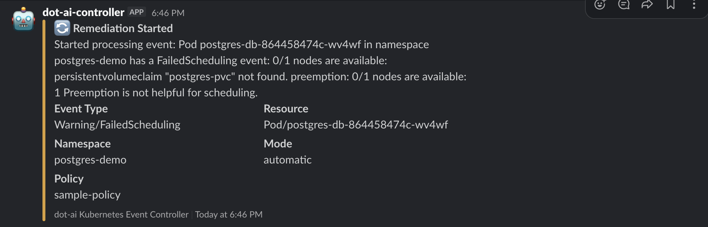
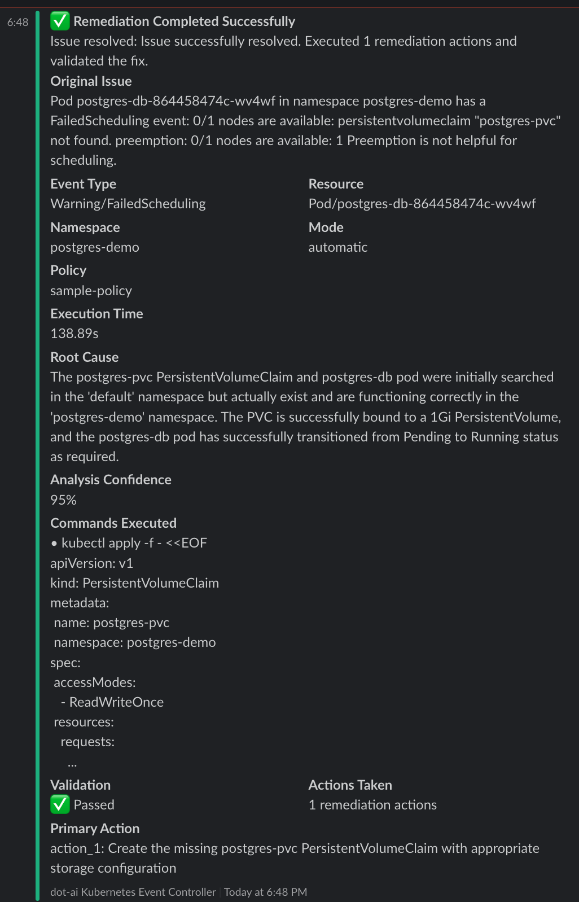

# Remediation Guide

This guide covers the RemediationPolicy CRD for event-driven remediation using the DevOps AI Toolkit.

## Prerequisites

- Controller installed (see [Setup Guide](setup-guide.md))
- **DevOps AI Toolkit MCP installed** - See [DevOps AI Toolkit documentation](https://github.com/vfarcic/dot-ai)
- Slack webhook URL (optional, for notifications)

## Overview

The RemediationPolicy CRD monitors Kubernetes events and forwards them to the DevOps AI Toolkit MCP for analysis and remediation. It supports:

- **Event Watching**: Configurable filtering of Kubernetes events by type, reason, and involved objects
- **Automatic Mode**: System detects, analyzes, and fixes issues without human intervention
- **Manual Mode**: System detects and analyzes issues, provides recommendations via Slack for humans to execute
- **Slack Notifications**: Rich notifications with remediation results and next steps
- **Rate Limiting**: Prevents event storms with configurable cooldowns
- **Status Reporting**: Comprehensive observability through status updates

## Create a RemediationPolicy

Create a RemediationPolicy to start processing events:

```bash
# Set your Slack webhook URL (optional)
export SLACK_WEBHOOK_URL="https://hooks.slack.com/services/YOUR/WEBHOOK/URL"

# Apply the policy
kubectl apply --filename - <<EOF
apiVersion: dot-ai.devopstoolkit.live/v1alpha1
kind: RemediationPolicy
metadata:
  name: sample-policy
  namespace: dot-ai
spec:
  # Multiple event selectors with different configurations
  # NOTE: Controller checks selectors in order and processes event on FIRST match
  eventSelectors:
    # Monitor pod scheduling failures - AUTOMATIC remediation
    - type: Warning
      reason: FailedScheduling
      involvedObjectKind: Pod
      mode: automatic                 # Safe to automatically fix scheduling issues
      confidenceThreshold: 0.85       # High confidence required for infrastructure changes
      maxRiskLevel: medium            # Allow medium-risk actions for infrastructure fixes

    # Monitor ALL remaining Warning events for ANY resource - MANUAL mode
    - type: Warning
      reason: ""                      # Empty = wildcard, matches ANY event reason
      involvedObjectKind: ""          # Empty = wildcard, matches ANY resource type

  # MCP endpoint using internal service URL
  mcpEndpoint: http://dot-ai-mcp.dot-ai.svc.cluster.local:3456/api/v1/tools/remediate
  mcpTool: remediate

  # Manual mode as global default (conservative approach)
  mode: manual

  # Global automatic mode configuration (used when mode=automatic)
  confidenceThreshold: 0.8            # Require 80% confidence for automatic actions
  maxRiskLevel: low                   # Only allow low-risk automatic actions by default

  # Conservative rate limiting for production
  rateLimiting:
    eventsPerMinute: 5                # Lower rate for production safety
    cooldownMinutes: 15               # Longer cooldown to prevent spam

  # Slack notifications configuration
  notifications:
    slack:
      enabled: true                    # Enable Slack notifications
      webhookUrl: "$SLACK_WEBHOOK_URL" # Your webhook URL
      channel: "#alerts"               # Channel where notifications will be sent
      notifyOnStart: true              # Notify when remediation starts
      notifyOnComplete: true           # Notify when remediation completes
EOF

# Verify the policy was created
kubectl get remediationpolicies --namespace dot-ai
```

## Understanding Remediation Modes

### Automatic Mode

The system detects, analyzes, and fixes issues without human intervention.

**Use when:**
- Issues are low-risk and well-understood
- Fast remediation is critical
- You have high confidence thresholds configured

**Safety controls:**
- `confidenceThreshold`: Minimum confidence (0.0-1.0) required for execution
- `maxRiskLevel`: Maximum risk level allowed (`low`, `medium`, `high`)

### Manual Mode

The system detects and analyzes issues, then provides remediation recommendations via Slack for humans to execute.

**Use when:**
- Issues require human judgment
- Changes affect production systems
- You want approval before execution

**Workflow:**
1. Controller detects event
2. MCP analyzes issue and generates recommendations
3. Slack notification sent with specific kubectl commands
4. Human reviews and executes commands when ready

## Example 1: Manual Remediation

Let's test manual remediation by creating a memory-constrained application that will trigger OOMKilled warnings:

```bash
# Create a test namespace
kubectl create namespace memory-demo

# Create a memory-hungry application with insufficient memory limits
kubectl apply --filename - <<'EOF'
apiVersion: apps/v1
kind: Deployment
metadata:
  name: memory-hungry-app
  namespace: memory-demo
spec:
  replicas: 1
  selector:
    matchLabels:
      app: memory-hungry
  template:
    metadata:
      labels:
        app: memory-hungry
    spec:
      containers:
      - name: app
        image: ghcr.io/distroless/busybox:latest
        command: ["/bin/sh"]
        args: ["-c", "dd if=/dev/zero of=/tmp/memory.tmp bs=1M count=200; sleep 3600"]
        resources:
          limits:
            memory: "64Mi"
          requests:
            memory: "32Mi"
EOF

# Check the pod status (should show OOMKilled restarts)
kubectl get pods --selector app=memory-hungry --namespace memory-demo

# View the Warning events
kubectl get events --namespace memory-demo --field-selector type=Warning,reason=BackOff

# Check controller logs to see event processing
kubectl logs --selector app.kubernetes.io/name=dot-ai-controller --namespace dot-ai --tail 20
```

### What Happens in Manual Mode

1. **Event Detection**: The controller detects Warning events for container restarts due to OOMKilled
2. **Policy Matching**: Matches the second event selector (wildcard Warning + manual mode from global policy)
3. **MCP Analysis**: The system analyzes the issue and generates specific remediation commands
4. **Slack Notification**: Sends detailed notification with:
   - Problem analysis and root cause
   - **Recommended commands** to fix the issue (e.g., `kubectl patch deployment...` to increase memory limits)
   - Step-by-step remediation instructions
5. **Human Decision**: Users can:
   - Execute the recommended kubectl commands directly
   - Apply changes to YAML files in Git (GitOps workflow)
   - Modify Helm values and redeploy
   - Use any other approach they prefer

**Key Difference**: In manual mode, the controller gets remediation recommendations and forwards them to Slack, but **never executes** the commands. Humans review the recommendations and decide how/when to implement them.

**Slack Notification - Manual Remediation Started:**


### Manual Remediation Analysis Results

The analysis completed successfully, providing detailed recommendations without executing them:

**Slack Notification - Manual Analysis Completed:**


**Manual Mode Results:**
- **Analysis Confidence**: 95%
- **Execution Time**: 79.78 seconds
- **Root Cause**: Container attempts to allocate 200MB but has 64Mi limit, causing OOMKilled failures
- **Recommended Action**: Specific `kubectl patch` command to increase memory limits to 256Mi with requests of 128Mi
- **Human Decision Required**: The system provides the exact command but waits for human execution

Users can now execute the recommended command:
```bash
kubectl patch deployment/memory-hungry-app -n memory-demo -p '{"spec":{"template":{"spec":{"containers":[{"name":"app","resources":{"limits":{"memory":"256Mi"},"requests":{"memory":"128Mi"}}}]}}}}'
```

## Example 2: Automatic Remediation

Now let's test automatic remediation with a real scenario - a PostgreSQL deployment that fails due to a missing PersistentVolumeClaim:

```bash
# Create a test namespace
kubectl create namespace postgres-demo

# Deploy PostgreSQL without creating the required PVC (this will cause FailedScheduling)
kubectl apply --namespace postgres-demo --filename - <<'EOF'
apiVersion: apps/v1
kind: Deployment
metadata:
  name: postgres-db
spec:
  replicas: 1
  selector:
    matchLabels:
      app: postgres
  template:
    metadata:
      labels:
        app: postgres
    spec:
      containers:
      - name: postgres
        image: postgres:13
        env:
        - name: POSTGRES_PASSWORD
          value: testpass
        - name: POSTGRES_DB
          value: testdb
        volumeMounts:
        - name: postgres-storage
          mountPath: /var/lib/postgresql/data
      volumes:
      - name: postgres-storage
        persistentVolumeClaim:
          claimName: postgres-pvc
EOF

# Check the pod status (should be Pending)
kubectl get pods --namespace postgres-demo

# View the Warning events that will trigger remediation
kubectl get events --namespace postgres-demo --field-selector type=Warning

# Check controller logs to see event processing
kubectl logs --selector app.kubernetes.io/name=dot-ai-controller --namespace dot-ai --tail 20
```

### What Happens in Automatic Mode

1. **Event Detection**: The controller detects the `FailedScheduling` Warning event
2. **Policy Matching**: Matches the first event selector (FailedScheduling + Pod + automatic mode)
3. **Slack Notification**: Sends "Remediation Started" notification with:
   - Event details (Warning/FailedScheduling)
   - Resource info (Pod/postgres-db-...)
   - Namespace (postgres-demo)
   - Mode (automatic)
   - Policy (sample-policy)
4. **MCP Request**: Sends automatic remediation request with:
   - High confidence threshold (0.85)
   - Medium risk level allowed
   - Detailed event description

**Slack Notification - Remediation Started:**


### Automatic Remediation Success

The system automatically resolved the issue! Here's what happened:

```bash
# The missing PVC was automatically created
kubectl get pvc --namespace postgres-demo

# The pod is now running successfully
kubectl get pods --namespace postgres-demo

# Check the remediation success event
kubectl get events --namespace dot-ai --field-selector reason=McpRequestSucceeded
```

**Remediation Results:**
- **Execution Time**: 138.89 seconds
- **Analysis Confidence**: 95%
- **Actions Taken**: 1 remediation action
- **Validation**: ✅ Passed - Pod transitioned from Pending to Running
- **Root Cause**: The postgres-pvc PersistentVolumeClaim was missing from the postgres-demo namespace
- **Solution**: Automatically created the missing PVC with appropriate storage configuration

**What the System Did:**
1. **Analyzed** the FailedScheduling event and identified the missing PersistentVolumeClaim
2. **Created** the postgres-pvc PersistentVolumeClaim in the postgres-demo namespace with:
   - 1Gi capacity
   - ReadWriteOnce access mode
   - Standard storage class
3. **Validated** the fix by confirming the pod moved from Pending to Running status

This demonstrates the power of **automatic remediation** - the system detected, analyzed, fixed, and validated the issue without human intervention, all while maintaining safety through confidence thresholds and risk levels.

**Slack Notification - Remediation Completed:**


## RemediationPolicy Configuration

### Event Selectors

Event selectors filter which Kubernetes events trigger remediation:

```yaml
eventSelectors:
  # Specific event type
  - type: Warning                    # Event type: Warning, Normal
    reason: FailedScheduling         # Specific event reason
    involvedObjectKind: Pod          # Resource type: Pod, Deployment, etc.
    namespace: production            # Optional: specific namespace
    mode: automatic                  # Override global mode for this selector

  # Wildcard selector (matches everything)
  - type: Warning
    reason: ""                       # Empty = matches ANY reason
    involvedObjectKind: ""           # Empty = matches ANY resource type
```

**Important**: Selectors are evaluated in order. The first matching selector's configuration is used.

### Mode Configuration

```yaml
# Global default mode
mode: manual                         # manual or automatic

# Per-selector override
eventSelectors:
  - type: Warning
    reason: FailedScheduling
    mode: automatic                  # Override global mode for this selector
```

### Safety Thresholds

```yaml
# Global thresholds (used when mode=automatic)
confidenceThreshold: 0.8             # 0.0-1.0, higher = more conservative
maxRiskLevel: low                    # low, medium, or high

# Per-selector override
eventSelectors:
  - type: Warning
    reason: FailedScheduling
    mode: automatic
    confidenceThreshold: 0.9         # Require 90% confidence for this event type
    maxRiskLevel: medium             # Allow medium-risk actions
```

### Rate Limiting

```yaml
rateLimiting:
  eventsPerMinute: 10                # Maximum events processed per minute
  cooldownMinutes: 5                 # Wait time after processing an event
```

### Slack Notifications

```yaml
notifications:
  slack:
    enabled: true
    webhookUrl: "https://hooks.slack.com/services/..."
    channel: "#alerts"
    notifyOnStart: true              # Notify when remediation starts
    notifyOnComplete: true           # Notify when remediation completes
```

## Monitoring RemediationPolicies

### View Policy Status

```bash
# List all policies
kubectl get remediationpolicies --all-namespaces

# Get detailed status
kubectl get remediationpolicy sample-policy --namespace dot-ai --output yaml

# Watch for updates
kubectl get remediationpolicies --namespace dot-ai --watch
```

### Check Policy Metrics

```bash
# View policy status
kubectl get remediationpolicy sample-policy --namespace dot-ai --output jsonpath='{.status}' | jq

# Key metrics:
# - totalEventsProcessed: Total events matched by this policy
# - successfulRemediations: Successful remediation attempts
# - failedRemediations: Failed remediation attempts
# - rateLimitedEvents: Events skipped due to rate limiting
```

### Controller Logs

```bash
# View recent logs
kubectl logs --selector app.kubernetes.io/name=dot-ai-controller --namespace dot-ai --tail 50

# Follow logs in real-time
kubectl logs --selector app.kubernetes.io/name=dot-ai-controller --namespace dot-ai --follow

# Search for specific events
kubectl logs --selector app.kubernetes.io/name=dot-ai-controller --namespace dot-ai | grep "FailedScheduling"
```

## Best Practices

### Start Conservative

1. **Begin with manual mode** for all events
2. **Monitor Slack notifications** to understand what issues occur
3. **Gradually enable automatic mode** for specific, low-risk event types
4. **Increase confidence thresholds** as you gain trust in the system

### Event Selector Ordering

Order selectors from most specific to least specific:

```yaml
eventSelectors:
  # 1. Specific high-confidence scenarios (automatic)
  - type: Warning
    reason: FailedScheduling
    involvedObjectKind: Pod
    namespace: development
    mode: automatic
    confidenceThreshold: 0.9

  # 2. Broader scenarios (manual)
  - type: Warning
    reason: FailedScheduling
    involvedObjectKind: Pod
    mode: manual

  # 3. Catch-all (manual, low priority)
  - type: Warning
    reason: ""
    mode: manual
```

### Production Safety

For production environments:

```yaml
spec:
  mode: manual                       # Default to manual for safety
  confidenceThreshold: 0.9           # High confidence required
  maxRiskLevel: low                  # Only low-risk automatic actions
  rateLimiting:
    eventsPerMinute: 3               # Conservative rate limit
    cooldownMinutes: 30              # Long cooldown to prevent storms
```

### Testing Strategy

1. **Test in development first** with automatic mode enabled
2. **Review Slack notifications** for accuracy and usefulness
3. **Validate automatic remediations** work as expected
4. **Gradually roll out to production** starting with manual mode

## Troubleshooting

### Events Not Being Processed

1. Check if policy exists and is in Ready state:
```bash
kubectl get remediationpolicy --namespace dot-ai
kubectl describe remediationpolicy sample-policy --namespace dot-ai
```

2. Verify MCP endpoint is accessible:
```bash
kubectl get svc --namespace dot-ai
kubectl run test-curl --image=curlimages/curl --rm -it --restart=Never -- curl http://dot-ai-mcp.dot-ai.svc.cluster.local:3456/health
```

3. Check controller logs for errors:
```bash
kubectl logs --selector app.kubernetes.io/name=dot-ai-controller --namespace dot-ai --tail 100 | grep -i error
```

### Slack Notifications Not Received

1. Verify webhook URL is correct:
```bash
kubectl get remediationpolicy sample-policy --namespace dot-ai -o jsonpath='{.spec.notifications.slack.webhookUrl}'
```

2. Test webhook manually:
```bash
curl -X POST -H 'Content-type: application/json' \
  --data '{"text":"Test notification"}' \
  YOUR_WEBHOOK_URL
```

3. Check controller logs:
```bash
kubectl logs --selector app.kubernetes.io/name=dot-ai-controller --namespace dot-ai | grep -i slack
```

### Rate Limiting Issues

If events are being rate limited:

```bash
# Check rate limited count
kubectl get remediationpolicy sample-policy --namespace dot-ai -o jsonpath='{.status.rateLimitedEvents}'

# Adjust rate limits
kubectl patch remediationpolicy sample-policy --namespace dot-ai --type merge -p '
spec:
  rateLimiting:
    eventsPerMinute: 20
    cooldownMinutes: 2
'
```

## Cleanup

Remove test resources:

```bash
# Delete test namespaces
kubectl delete namespace memory-demo postgres-demo

# Delete remediation policy
kubectl delete remediationpolicy sample-policy --namespace dot-ai
```

## Next Steps

- Review [Solution Guide](solution-guide.md) for resource tracking and lifecycle management
- Check [Troubleshooting Guide](troubleshooting.md) for common issues
- Explore [DevOps AI Toolkit](https://github.com/vfarcic/dot-ai) for MCP capabilities
